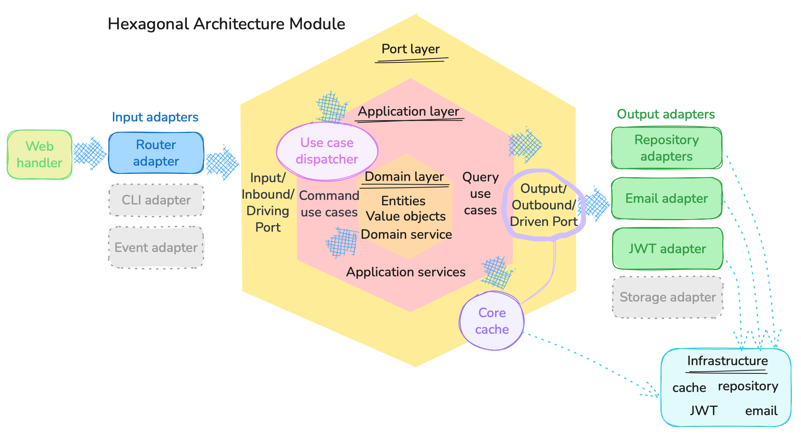
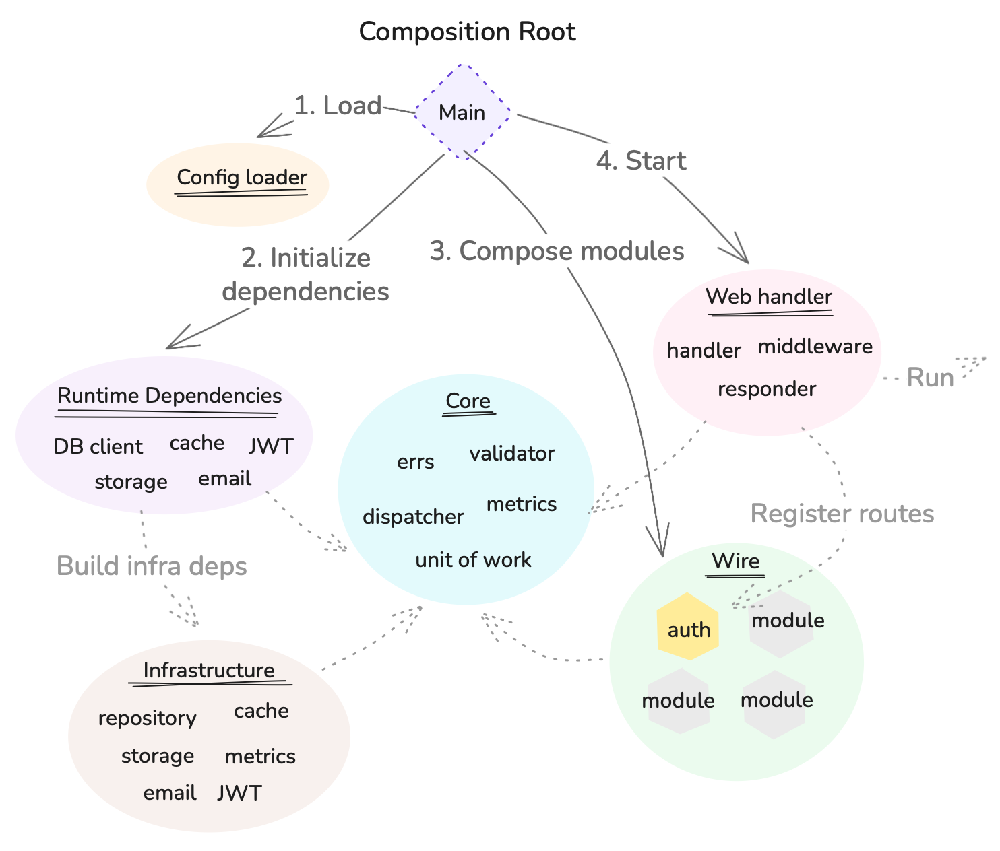
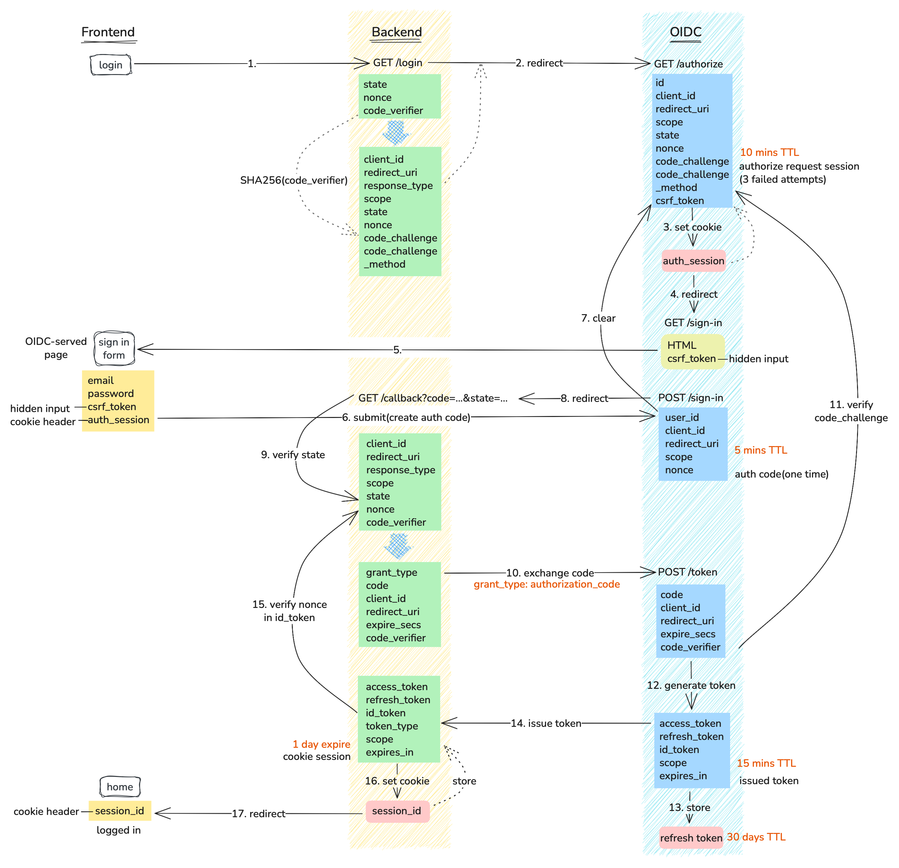
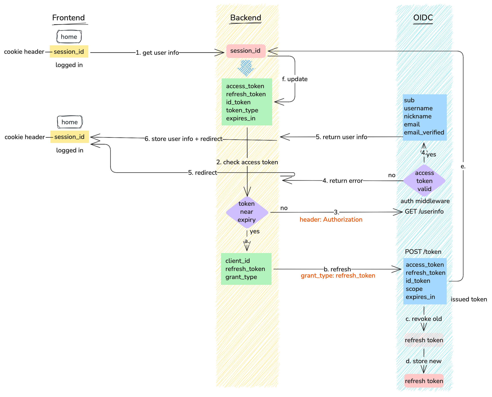

# OIDC Auth Server

An OIDC server written in Go with a production-oriented hexagonal architecture, supporting Authorization Code Flow, refresh token rotation, brute-force lockout, and a broad OIDC/OAuth2 provider surface.

---

## Prerequisites

| Tool | Version | Purpose |
|---|---|---|
| Go | 1.26+ | Build and run |
| `ssh-keygen` | any | Generate RSA key pair |
| `openssl` | any | Convert public key format |
| `curl` + `jq` | any | E2E test script |
| `k6` | any | Smoke tests (optional) |
| `act` | any | Run CI jobs locally (optional) |

---

## Features

- **Authorization Code Flow** — state and nonce validation; PKCE (S256) required for public clients, with RFC 6749 §4.1.2.1 error redirects
- **Token lifecycle** — RS256-signed access tokens, opaque refresh tokens with rotation, ID tokens with nonce
- **Security** — CSRF protection on sign-in, brute-force lockout after three failed attempts, atomic session consumption, distributed rate limiting
- **OIDC provider surface** — Discovery, JWKS, UserInfo, token introspection (RFC 7662), token revocation (RFC 7009), logout
- **RFC 6749 errors** — token/revoke/introspect return `{error, error_description}` (§5.2) with `WWW-Authenticate` on `invalid_client`; `/authorize` returns §4.1.2.1 error redirects
- **Storage** — pluggable: file-based (default) or MongoDB
- **Cache** — pluggable: in-memory (default) or Redis
- **Password reset** — email-based reset flow (rate-limited to 3/hour per email); logs reset links to stdout when `SMTP_HOST` is unset

---

## Repository Map

```
cmd/
  auth/           — server entry point, wiring, config
  backend/        — local browser-based OIDC test harness (localhost:3000)
modules/
  auth/
    application/  — use cases (command/, query/, service/)
    domain/       — entities and value objects
    port/         — outbound port interfaces
    adapter/      — inbound HTTP router (router.go)
    adapter/out/  — outbound adapters (JWT, repos, email)
    errors/       — domain error codes
handler/
  web/            — HTTP handlers, middleware, binding, response
core/
  cache/          — cache port interface
  error/          — shared error types and codes
  jwt/            — JWT claims types
  uow/            — unit-of-work interface
  usecase/        — dispatcher and registry
  validator/      — struct validation helpers
  web/            — server config and cookie helpers
infrastructure/
  jwt/            — RS256 JWT service
  cache/          — Redis and in-memory cache
  repository/     — MongoDB and file-based repo drivers
  smtp/           — persistent SMTP client (STARTTLS, reconnect, deadline enforcement)
conformance/      — in-process OIDC conformance suite (Go httptest)
e2e/              — shell-based end-to-end test suite
smoke_test/       — k6 smoke scripts per endpoint and flow verification
http/             — auth.http IDE request file (VS Code / IntelliJ)
docs/             — architecture diagrams, flow analysis, API spec
```

---

## Architecture

This project follows hexagonal architecture (ports & adapters). The application core is fully isolated from HTTP and infrastructure concerns.

```
         ┌─────────────────────────────────────────┐
         │           Application Core               │
         │                                          │
  HTTP   │  application/command   domain/entity     │  File / Mongo
  Gin  ──┤  application/query     modules/auth/port ├── infrastructure/
  JSON   │  application/define    modules/auth/     │  repository/
         │                        errors            │  cache/
         └─────────────────────────────────────────┘
              ▲ driving ports            driven ports ▼
         handler/web/              modules/auth/adapter/out/
```



Sequence diagram: [`docs/oidc-flow-current.mermaid`](docs/oidc-flow-current.mermaid)  
OpenAPI spec: [`docs/auth.yaml`](docs/auth.yaml)

<details>
<summary>Diagrams: composition root, Authorization Code Flow, token refresh</summary>

The composition root (`cmd/auth/main.go`) loads config, builds cross-cutting infrastructure, composes the module, and wires it into the web handler:



Authorization Code Flow:



Token refresh flow:



</details>

---

## Quick Start

### 1. Generate RSA key pair

```sh
mkdir -p cmd/auth/.secret

ssh-keygen -t rsa -b 2048 -m PEM -N "" -f cmd/auth/.secret/private_key.pem

openssl rsa -in cmd/auth/.secret/private_key.pem -pubout \
  -outform PEM -out cmd/auth/.secret/public_key.pem
```

### 2. Create `cmd/auth/.env`

The server loads config from `cmd/auth/.env` by default (relative to `cmd/auth/main.go`). Use `ENV_PATH` to point elsewhere. If the default file is missing, the server continues with process environment variables; only an explicitly set `ENV_PATH` must exist.

```sh
cat > cmd/auth/.env << EOF
PORT=:9876
PRIVATE_KEY_PATH=cmd/auth/.secret/private_key.pem
PUBLIC_KEY_PATH=cmd/auth/.secret/public_key.pem
JWT_KID=local
JWT_ISSUER=http://localhost:9876
REPOSITORY_USED=file
FILE_DIR=tmp
USER_FILE_PATH=user.json
OAUTH_CLIENT_ID=my_client
OAUTH_CLIENT_REDIRECT_URIS=http://localhost:3000/callback
OAUTH_POST_LOGOUT_REDIRECT_ALLOWLIST=http://localhost:3000
COOKIE_SECURE=false
EMAIL_ENCRYPTION_KEY=$(openssl rand -base64 32)
EMAIL_BLIND_INDEX_KEY=$(openssl rand -base64 32)
EOF
```

A fully annotated example is at [`cmd/auth/.env.example`](cmd/auth/.env.example).

### 3. Run the auth server

```sh
go run cmd/auth/main.go
```

Server starts at **http://localhost:9876**  
For OIDC clients, start with the discovery document:
http://localhost:9876/.well-known/openid-configuration

### 4. Run the test client (optional)

`cmd/backend` is a browser-based OIDC client for exercising the full Authorization Code Flow manually.

```sh
go run cmd/backend/main.go
```

Client starts at **http://localhost:3000** — click "Login with IdP" to initiate the flow.

---

## Docker

The production image is a distroless multi-stage build (`Dockerfile`). The runtime stage uses `gcr.io/distroless/static-debian12:nonroot` (non-root, no shell, only ~4 OS packages). Base images are pinned by digest. No `.env` file or private keys are baked in — all config is supplied via environment variables at `docker run` time.

The CI `container` job builds the image and scans it with Trivy on every push.

```sh
docker build -t auth .

docker run --rm -p 9876:9876 \
  -v "$PWD/cmd/auth/.secret:/keys:ro" \
  -e PORT=9876 \
  -e PRIVATE_KEY_PATH=/keys/private_key.pem \
  -e PUBLIC_KEY_PATH=/keys/public_key.pem \
  -e JWT_KID=local \
  -e JWT_ISSUER=http://localhost:9876 \
  -e REPOSITORY_USED=file -e FILE_DIR=/tmp -e USER_FILE_PATH=user.json \
  -e EMAIL_ENCRYPTION_KEY=$(openssl rand -base64 32) \
  -e EMAIL_BLIND_INDEX_KEY=$(openssl rand -base64 32) \
  -e OAUTH_CLIENT_ID=my_client \
  -e OAUTH_CLIENT_REDIRECT_URIS=http://localhost:3000/callback \
  auth
```

---

## Development Workflow

```sh
# Format
gofmt -w .

# Vet
go vet ./...

# Lint (matches CI)
golangci-lint run

# Unit tests (all packages)
go test ./...

# Unit tests — single package, no cache
go test -count=1 ./modules/auth/application/command/...

# Race detector
go test -race ./...

# Build
go build ./...
```

---

## Tests

### Unit tests

Table-driven tests alongside the code they test. Run before any commit touching use cases, commands, queries, entities, or repositories.

```sh
go test ./...
```

### OIDC conformance suite (`conformance/`)

In-process Go suite that boots the real auth module over an `httptest` server
(file + in-memory adapters, real RSA keys, issuer = server URL) and asserts OIDC
Core + RFC conformance: discovery metadata, JWKS shape, the full
authorization-code + PKCE flow, **id_token signature verification against the
published JWKS**, UserInfo, single-use authorization codes, and RFC 6749 error
bodies/redirects. Runs as part of `go test ./...`, no external services.

```sh
go test ./conformance/ -run TestOIDCConformance -v
```

### E2E tests (`e2e/test_auth.sh`)

Shell script that exercises the full server over HTTP: sign-up, internal/trusted-client password grant, Authorization Code Flow (CSRF, state, nonce), refresh, introspect, revoke, logout.

```sh
# Server already running (CI / remote / Docker)
BASE_URL=http://localhost:9876 bash e2e/test_auth.sh

# Let the script start and stop the server for you (local convenience)
START_SERVER=1 bash e2e/test_auth.sh
```

`START_SERVER=1` runs `go run ./cmd/auth/main.go` in the background using `cmd/auth/.env`, waits up to 30 seconds for readiness, then kills the process on exit.

### Smoke tests (`smoke_test/`)

k6 scripts covering each endpoint area, plus `all.js` as a combined suite. Use them as quick health/regression checks against a local, staging, or deployed environment; they are not intended to measure capacity or find stress limits.

The smoke tests use `client_id=smoke-client` and `redirect_uri=https://app.example.com/callback`. Register that client before running the suite — either as the primary client (`OAUTH_CLIENT_ID=smoke-client`, `OAUTH_CLIENT_REDIRECT_URIS=https://app.example.com/callback`) or as an additional one (`OAUTH_CLIENT_2_ID=smoke-client`, `OAUTH_CLIENT_2_REDIRECT_URIS=https://app.example.com/callback`). The logout test also needs `OAUTH_POST_LOGOUT_REDIRECT_ALLOWLIST=https://app.example.com/logged-out` (matched exactly).

The shell-based E2E test validates one coherent OIDC/auth lifecycle, while the k6 smoke tests validate broad endpoint availability and basic response behavior.

```sh
k6 run smoke_test/all.js
k6 run -e BASE_URL=http://staging:9876 smoke_test/all.js
```

### Browser flow (`e2e/backend_flow/`)

A browser-driven smoke of the `cmd/backend` test client's UI (create user → login → userinfo → update profile → introspect → refresh → revoke → logout), complementing the curl/k6 API-level suites. `run.sh` starts the IdP (`:9876`) and `cmd/backend` (`:3000`) against an ephemeral file store, registering `my_client2` as a public PKCE client; the browser steps are then executed via the Playwright MCP browser per [`SCENARIO.md`](e2e/backend_flow/SCENARIO.md) — no Playwright npm dependency is installed.

```sh
bash e2e/backend_flow/run.sh   # starts servers, waits; Ctrl-C to stop and discard the store
```

### IDE request file ([`http/auth.http`](http/auth.http))

VS Code REST Client / IntelliJ HTTP Client file with pre-built requests for every endpoint. Useful for manual exploration.

### CI

```sh
act -j e2e       # full e2e
act -j test      # build + vet + unit tests (race)
act -j lint      # golangci-lint
act -j vuln      # govulncheck
act -j licenses  # license compliance
act -j secrets   # gitleaks secret scan
```

---

## API Reference

Full OpenAPI spec: [`docs/auth.yaml`](docs/auth.yaml)

### OIDC / OAuth2

| Method | Path | Description |
|---|---|---|
| `GET` | `/authorize` | Start Authorization Code Flow |
| `GET` | `/sign-in` | Sign-in page (CSRF token injected) |
| `POST` | `/sign-in` | Submit credentials; issues auth code |
| `POST` | `/token` | Token endpoint — `authorization_code`, `refresh_token`, and internal/trusted-client `password` grants |
| `GET` | `/userinfo` | UserInfo claims (Bearer token) |
| `GET` | `/.well-known/openid-configuration` | OIDC Discovery document |
| `GET` | `/.well-known/jwks.json` | JSON Web Key Set |

### Session management

| Method | Path | Description |
|---|---|---|
| `GET` | `/oidc/logout` | Logout / best-effort session termination |
| `POST` | `/oidc/revoke` | Token revocation (RFC 7009) |
| `POST` | `/oidc/introspect` | Token introspection (RFC 7662) |
| `GET` | `/oidc/me` | Profile (authenticated) |

### Keycloak-compatible aliases

| Method | Path | Canonical equivalent |
|---|---|---|
| `GET` | `/protocol/openid-connect/auth` | `/authorize` |
| `POST` | `/protocol/openid-connect/token` | `/token` |
| `GET` | `/protocol/openid-connect/certs` | `/.well-known/jwks.json` |
| `GET` | `/protocol/openid-connect/userinfo` | `/userinfo` |

### Account

| Method | Path | Description |
|---|---|---|
| `GET` | `/sign-up` | Sign-up page |
| `POST` | `/sign-up` | Register a new user |
| `POST` | `/forgot-password` | Send password reset email |
| `POST` | `/reset-password` | Apply reset token and new password |
| `POST` | `/api/v3/update-profile` | Update username / nickname / email (Bearer token) |

### Observability

| Method | Path | Description |
|---|---|---|
| `GET` | `/debug/vars` | Expvar metrics (failed logins, tokens issued) — served only on the internal `METRICS_ADDR` listener, not on the public port |

---

## Persistence

File storage writes two files under `FILE_DIR` (default `tmp/`). It is intended for local development or single-instance deployments; use MongoDB for shared/durable storage in multi-instance environments.

| File | Contents |
|---|---|
| `user.json` | User accounts |
| `refresh_tokens.json` | Active refresh tokens |

Both are safe to delete to reset local state. They are created automatically on first write.

---

## Troubleshooting

| Symptom | Likely cause |
|---|---|
| Server panics at startup | Explicit `ENV_PATH` points to a missing file, or a required variable is missing (`OAUTH_CLIENT_ID`, `EMAIL_ENCRYPTION_KEY`, `EMAIL_BLIND_INDEX_KEY`); a missing default `cmd/auth/.env` no longer panics (process env is used) |
| `failed to parse private key` | Key was generated with a passphrase — regenerate with `-N ""` |
| `client redirect_uri not valid` | `client_id` matches no registered client (`OAUTH_CLIENT_ID` / `OAUTH_CLIENT_<n>_ID`), or `redirect_uri` is not in that client's `*_REDIRECT_URIS` |
| `auth_session` cookie not sent to `/sign-in` | Cookie was blocked by `SameSite=Strict`; server correctly uses `SameSite=Lax` — check client |
| Redis connection errors | Server falls back to in-memory cache automatically; check logs for the warning |
| Port already in use | Another process on `:9876` — change `PORT` in `.env` |
| E2E script fails: `jq: command not found` | Install `jq` |
| Stale user / token state | Delete `tmp/user.json` and `tmp/refresh_tokens.json`, then restart |
| E2E logout test returns 200 instead of 302 | `OAUTH_POST_LOGOUT_REDIRECT_ALLOWLIST` not set — add `http://localhost:3000` to the allowlist |

---

## Configuration

Config is read from process environment variables, optionally supplemented by `cmd/auth/.env` (default path, optional) or the file at `ENV_PATH` (must exist when set); existing env vars always win over the file.

### Required

| Variable | Example | Description |
|---|---|---|
| `PORT` | `:9876` or `9876` | Listen address (a bare port number is accepted) |
| `PRIVATE_KEY_PATH` | `cmd/auth/.secret/private_key.pem` | RSA private key for JWT signing (unencrypted PEM) |
| `PUBLIC_KEY_PATH` | `cmd/auth/.secret/public_key.pem` | RSA public key for JWT verification |
| `JWT_KID` | `local` | Key ID embedded in JWT header |
| `JWT_ISSUER` | `http://localhost:9876` | `iss` claim value — must match the URL clients use |
| `REPOSITORY_USED` | `file` \| `mongo` | Storage backend |
| `EMAIL_ENCRYPTION_KEY` | `$(openssl rand -base64 32)` | Base64-encoded 32-byte key for email-at-rest encryption (AES-256-GCM); generate with `openssl rand -base64 32` |
| `EMAIL_BLIND_INDEX_KEY` | `$(openssl rand -base64 32)` | Base64-encoded HMAC key for email blind-index lookups; generate with `openssl rand -base64 32` |

### Storage — file (default)

| Variable | Example | Description |
|---|---|---|
| `FILE_DIR` | `tmp` | Directory for file-based repositories |
| `USER_FILE_PATH` | `user.json` | User store filename within `FILE_DIR` |

### Storage — MongoDB

| Variable | Description |
|---|---|
| `MONGO_HOST` | MongoDB host |
| `MONGO_USER` | Username |
| `MONGO_PASSWORD` | Password |
| `MONGO_AUTH_SOURCE` | Auth database |
| `MONGO_DATABASE` | Target database |

### Cache — Redis (optional, falls back to in-memory)

If `REDIS_ADDR` is unset, the server uses an in-memory cache. In-memory cache is not shared across instances, so use Redis for multi-instance deployments where authorized sessions, auth codes, token blacklist entries, and rate-limit counters must be shared.

| Variable | Description |
|---|---|
| `REDIS_ADDR` | `host:port` — set to enable Redis |
| `REDIS_PASSWORD` | Redis password (optional) |
| `REDIS_DB` | Redis DB index (default `0`) |

### OAuth / OIDC

| Variable | Example | Description |
|---|---|---|
| `OAUTH_CLIENT_ID` | `my_client` | ID of the primary registered OAuth client. **Required** — startup panics when unset, unless `DEV_SEED=true` |
| `DEV_SEED` | `true` | Opt-in for local development only: registers the built-in `client-123` dev client when `OAUTH_CLIENT_ID` is unset |
| `METRICS_ADDR` | `127.0.0.1:9878` | Internal-only listener for `/debug/vars` (expvar). Empty disables it; never expose publicly |
| `OAUTH_CLIENT_REDIRECT_URIS` | `https://a.example.com/cb,https://a.example.com/cb2` | Comma-separated allowed redirect URIs for the client |
| `OAUTH_CLIENT_AUTH_METHOD` | `none` | `none` (public), `client_secret_basic`, or `client_secret_post`; default `none` |
| `OAUTH_CLIENT_SECRET` | `s3cret` | Client secret; required when auth method is not `none` (hashed at startup) |
| `OAUTH_CLIENT_ALLOWED_GRANTS` | `authorization_code,refresh_token` | Comma-separated allowed grant types; defaults to all supported grants |
| `OAUTH_CLIENT_<n>_*` | `OAUTH_CLIENT_2_ID=…` | Additional clients (`n` ≥ 2), each using the same `_ID`/`_AUTH_METHOD`/`_SECRET`/`_REDIRECT_URIS`/`_ALLOWED_GRANTS` suffixes. Parsing stops at the first missing `OAUTH_CLIENT_<n>_ID` |
| `OAUTH_POST_LOGOUT_REDIRECT_ALLOWLIST` | `https://app.example.com` | Comma-separated allowed post-logout URIs |
| `OAUTH_SCOPE_ALLOWLIST` | `openid,email,profile` | Comma-separated allowed scopes (default: `openid email profile phone`) |
| `CORS_ORIGINS` | `https://app.example.com` | Comma-separated CORS origins (default: `*`) |
| `COOKIE_SECURE` | `true` | Set `Secure` flag on cookies — enable in production (requires HTTPS) |

### SMTP (optional — required to send real password reset emails; logs to stdout otherwise)

| Variable | Description |
|---|---|
| `SMTP_HOST` | SMTP server host |
| `SMTP_PORT` | SMTP server port |
| `SMTP_FROM` | Sender address |
| `APP_BASE_URL` | Base URL used in reset email links |

### Other

| Variable | Description |
|---|---|
| `ENV_PATH` | Override default `cmd/auth/.env` location |

---

## Timeouts & TTL Reference

### OIDC / Auth

| Value | Duration | Constant | Source |
|---|---|---|---|
| Auth code TTL | 5 minutes | `AuthCodeTTL` | [`modules/auth/domain/entity/auth_code.go`](modules/auth/domain/entity/auth_code.go) |
| Authorize request TTL (session cookie + cache) | 10 minutes | `AuthorizeRequestTTL` | [`modules/auth/domain/entity/auth_request.go`](modules/auth/domain/entity/auth_request.go) |
| Refresh token TTL | 30 days | `RefreshTokenTTL` | [`modules/auth/domain/entity/tokens.go`](modules/auth/domain/entity/tokens.go) |
| Password reset token TTL | 15 minutes | `PasswordResetTokenTTL` | [`modules/auth/domain/entity/user.go`](modules/auth/domain/entity/user.go) |
| Access token default expiry | 15 minutes (900 s) | `DefaultExpirySecs` | [`modules/auth/application/define/token_expiration.go`](modules/auth/application/define/token_expiration.go) |
| Access token maximum expiry | 24 hours (86400 s) | `MaxTokenExpirySecs` | [`modules/auth/application/define/token_expiration.go`](modules/auth/application/define/token_expiration.go) |
| MongoDB TTL index on refresh tokens | at `expires_at` field | `SetExpireAfterSeconds(0)` | [`modules/auth/adapter/out/mongo_refresh_token_repository.go`](modules/auth/adapter/out/mongo_refresh_token_repository.go) |

### HTTP Server

| Value | Duration | Constant | Source |
|---|---|---|---|
| Read header timeout | 5 s | `readHeaderTimeout` | [`handler/web/server.go`](handler/web/server.go) |
| Read timeout | 30 s | `readTimeout` | [`handler/web/server.go`](handler/web/server.go) |
| Write timeout | 30 s | `writeTimeout` | [`handler/web/server.go`](handler/web/server.go) |
| Idle timeout | 60 s | `idleTimeout` | [`handler/web/server.go`](handler/web/server.go) |
| Graceful shutdown timeout | 5 s | `shutdownTimeout` | [`handler/web/server.go`](handler/web/server.go) |
| Cleanup timeout | 5 s | `cleanupTimeout` | [`handler/web/server.go`](handler/web/server.go) |
| CORS preflight cache (`Access-Control-Max-Age`) | 12 hours | — | [`handler/web/middleware/cors.go`](handler/web/middleware/cors.go) |

### Infrastructure

| Value | Duration | Constant | Source |
|---|---|---|---|
| Redis ping timeout | 5 s | `redisPingTimeout` | [`infrastructure/cache/redis.go`](infrastructure/cache/redis.go) |
| MongoDB connect timeout | 5 s | — | [`infrastructure/repository/mongo/client.go`](infrastructure/repository/mongo/client.go) |
| MongoDB server selection timeout | 10 s (default) | — | [`infrastructure/repository/mongo/client.go`](infrastructure/repository/mongo/client.go) |
| SMTP dial timeout | 10 s | `dialTimeout` | [`infrastructure/smtp/client.go`](infrastructure/smtp/client.go) |
| SMTP send timeout (I/O deadline) | 30 s | `sendTimeout` | [`infrastructure/smtp/client.go`](infrastructure/smtp/client.go) |
| Mongo index creation timeout | 10 s | — | [`modules/auth/adapter/out/`](modules/auth/adapter/out/) |

### Test Frontend (`cmd/backend`)

| Value | Duration | Constant | Source |
|---|---|---|---|
| Session cookie `MaxAge` | 24 hours (86400 s) | `sessionMaxAge` | [`cmd/backend/main.go`](cmd/backend/main.go) |
| Token proactive refresh threshold | 1 minute before expiry | `refreshThreshold` | [`cmd/backend/main.go`](cmd/backend/main.go) |
| Requested `expire_secs` sent to token endpoint | 120 s | — | [`cmd/backend/main.go`](cmd/backend/main.go) |

---

## Production Notes

- Serve the auth server over HTTPS and set `COOKIE_SECURE=true`.
- Use MongoDB for durable/shared storage when running outside local development.
- Use Redis for a shared cache / session state when running multiple instances.
- Do not commit `.env`, private keys, user stores, or refresh token stores.
- File storage and in-memory cache are convenient defaults for local development, but are not suitable for horizontally scaled deployments.
- Production container image defined in `Dockerfile` (distroless, nonroot, digest-pinned bases); configure entirely via environment variables — never bake `.env` or keys into the image.
